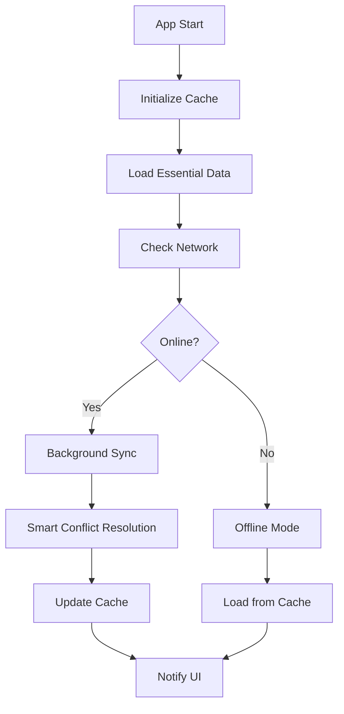

# TravelTurkey AsyncStorage Integration (2025)

## 📋 Overview

A comprehensive offline-first data storage solution for the TravelTurkey React Native application, implementing AsyncStorage with advanced caching strategies, intelligent synchronization, and modern 2025 best practices.

## 🚀 Features

### Core Capabilities

- **Offline-First Architecture**: App works seamlessly without internet connection
- **Intelligent Caching**: Multi-level caching with predictive preloading
- **Smart Synchronization**: Background sync with conflict resolution
- **Data Validation**: Comprehensive error handling and data integrity checks
- **Performance Optimization**: Lazy loading, compression, and efficient memory usage
- **React Native CLI 2025 Compatible**: Latest standards and TypeScript support

### Advanced Features

- **User-Based Personalization**: Cache strategy adapts to user preferences
- **Location-Aware Preloading**: Preload nearby places based on GPS location
- **Network-Aware Operations**: Adapts behavior based on connection type
- **Real-Time Updates**: Live data synchronization when online
- **Metrics & Analytics**: Performance tracking and cache hit rates
- **Memory Management**: Automatic cleanup and storage optimization

## 📁 Project Structure

```
src/
├── services/storage/
│   ├── AsyncStorageService.ts      # Core AsyncStorage wrapper
│   ├── OfflineCacheManager.ts      # Cache strategy and management
│   ├── DataSyncService.ts          # Synchronization service
│   └── index.ts                    # Centralized exports
├── hooks/
│   └── useOfflineStorage.ts        # React hook for storage
├── components/examples/
│   └── OfflineStorageExample.tsx   # Demo component
└── types/
    ├── touristPlaces.ts            # Data type definitions
    └── enhanced/
        └── touristPlace2025.ts     # Enhanced types
```

## 🛠️ Installation & Setup

### Prerequisites

- React Native CLI 0.80+
- TypeScript 5.0+
- @react-native-async-storage/async-storage 2.2.0+

### Basic Setup

```typescript
import { setupOfflineStorage, useOfflineStorage } from './src/services/storage';

// Initialize in App.tsx
useEffect(() => {
  setupOfflineStorage(userContext);
}, []);

// Use in components
const { touristPlaces, isLoading, getTouristPlaces, syncWithRemote } =
  useOfflineStorage();
```

### Advanced Configuration

```typescript
const userContext = {
  userId: 'user123',
  preferences: {
    favoriteCategories: ['historical', 'natural'],
    visitedPlaces: ['hagia-sophia'],
    plannedTrips: ['cappadocia'],
    language: 'tr',
    region: 'marmara',
  },
  location: {
    latitude: 41.0082,
    longitude: 28.9784,
  },
  deviceInfo: {
    storageAvailable: 1024 * 1024 * 500, // 500MB
    connectionType: 'wifi',
    batteryLevel: 80,
  },
};

const config = {
  enableAutoSync: true,
  syncInterval: 30, // minutes
  preloadStrategy: 'user-based',
  enableMetrics: true,
};

const storage = useOfflineStorage(userContext, config);
```

## 📊 API Reference

### AsyncStorageService

```typescript
// Store tourist places
await asyncStorageService.storeTouristPlaces(places, {
  version: '1.0.0',
  compress: true,
  validate: true,
});

// Retrieve with caching
const result = await asyncStorageService.getTouristPlaces({
  allowExpired: false,
  decompress: true,
});

// Batch operations
await asyncStorageService.batchOperations([
  { type: 'set', key: 'key1', value: data1 },
  { type: 'get', key: 'key2' },
]);

// Cache statistics
const stats = await asyncStorageService.getCacheStats();
```

### OfflineCacheManager

```typescript
// Initialize cache
await offlineCacheManager.initializeCache(userContext);

// Intelligent preloading
await offlineCacheManager.intelligentPreload(userContext);

// Cache cleanup
const result = await offlineCacheManager.cleanupCache(false);

// Subscribe to status updates
const unsubscribe = offlineCacheManager.subscribeToCacheUpdates(status =>
  console.log('Cache status:', status),
);
```

### DataSyncService

```typescript
// Sync all data
const syncResult = await dataSyncService.syncAll(userContext);

// Queue operations for later sync
await dataSyncService.queueSyncOperation('update', data, 'high');

// Resolve conflicts
const resolution = await dataSyncService.resolveConflict(
  localData,
  remoteData,
  'smart',
);

// Subscribe to sync updates
const unsubscribe = dataSyncService.subscribeToSyncUpdates(status =>
  console.log('Sync status:', status),
);
```

### useOfflineStorage Hook

```typescript
const {
  // Data
  touristPlaces,
  enhancedPlaces,
  isLoading,
  isInitialized,
  error,

  // Status
  cacheStatus,
  syncStatus,
  isOnline,
  syncInProgress,
  needsUpdate,

  // Operations
  getTouristPlaces,
  getEnhancedPlaces,
  refreshData,
  clearCache,
  syncWithRemote,
  forceSyncPlaces,
  getCacheStats,
  cleanupCache,
} = useOfflineStorage(userContext, config);
```

## 🎯 Caching Strategies

### Essential Strategy (25MB)

- Only featured and highly popular places
- Perfect for devices with limited storage
- WiFi-only sync

### Balanced Strategy (75MB)

- User's favorite categories
- Nearby places based on location
- Background sync with intelligent scheduling

### Aggressive Strategy (150MB)

- All tourist places and enhanced data
- Immediate sync for real-time updates
- Best for power users with unlimited data

```typescript
import { PRODUCTION_CONFIGS } from './src/services/storage';

// Use predefined strategies
const cacheManager = new OfflineCacheManager(PRODUCTION_CONFIGS.balanced);
```

## 🔄 Synchronization Flow



## 🛡️ Error Handling

```typescript
const { error, isOnline, syncStatus } = useOfflineStorage();

// Handle storage errors
if (error) {
  console.error('Storage error:', error.message);
  // Show user-friendly message
}

// Handle offline state
if (!isOnline) {
  // Show offline indicator
  // Disable sync-dependent features
}

// Handle sync conflicts
if (syncStatus.conflicts > 0) {
  // Show conflict resolution UI
  // Allow user to choose resolution strategy
}
```

## 📈 Performance Optimization

### Cache Hit Rate Optimization

```typescript
// Monitor cache performance
const stats = await getCacheStats();
if (stats.hitRate < 0.8) {
  // Adjust preloading strategy
  // Increase cache TTL
}
```

### Memory Management

```typescript
// Automatic cleanup based on usage
await cleanupCache(false); // Gentle cleanup
await cleanupCache(true); // Aggressive cleanup

// Monitor storage usage
const health = await getStorageHealth();
if (health.cache.healthScore < 70) {
  // Trigger cleanup
  // Adjust cache size limits
}
```

### Network Optimization

```typescript
// Adapt to connection type
const config = {
  networkOptimization: true,
  lowBandwidthMode: connectionType === 'cellular',
  allowMeteredConnection: false,
};
```

## 🧪 Testing

### Unit Tests

```typescript
import { asyncStorageService } from './src/services/storage';

describe('AsyncStorageService', () => {
  it('should store and retrieve tourist places', async () => {
    const places = [
      /* test data */
    ];
    const storeResult = await asyncStorageService.storeTouristPlaces(places);
    expect(storeResult.success).toBe(true);

    const getResult = await asyncStorageService.getTouristPlaces();
    expect(getResult.success).toBe(true);
    expect(getResult.data).toEqual(places);
  });
});
```

### Integration Tests

```typescript
import { useOfflineStorage } from './src/hooks/useOfflineStorage';
import { renderHook, waitFor } from '@testing-library/react-native';

it('should initialize and load data', async () => {
  const { result } = renderHook(() => useOfflineStorage());

  await waitFor(() => {
    expect(result.current.isInitialized).toBe(true);
  });

  expect(result.current.touristPlaces.length).toBeGreaterThan(0);
});
```

## 🚀 Production Deployment

### Environment Configuration

```typescript
// Production config
const productionConfig = {
  storage: {
    maxCacheSize: 100, // MB
    enableCompression: true,
    enableEncryption: true, // Enable for sensitive data
  },
  sync: {
    autoSync: true,
    conflictResolution: 'smart',
    networkTimeout: 30000,
  },
  cache: {
    preloadStrategy: 'balanced',
    maxStorageSize: 100,
    respectUserPreferences: true,
  },
};
```

### Monitoring & Analytics

```typescript
// Set up performance monitoring
const storage = useOfflineStorage(userContext, {
  enableMetrics: true,
  onPerformanceMetric: metric => {
    // Send to analytics service
    analytics.track('storage_performance', metric);
  },
});
```

## 🔧 Troubleshooting

### Common Issues

1. **High Memory Usage**

   - Reduce `preloadPercentage`
   - Enable aggressive cleanup
   - Use compression

2. **Slow Sync Performance**

   - Increase `batchSize`
   - Enable `enableDeltaSync`
   - Optimize network timeout

3. **Cache Misses**
   - Increase `cacheTtl`
   - Adjust preloading strategy
   - Monitor user patterns

### Debug Mode

```typescript
// Enable detailed logging
const storage = useOfflineStorage(userContext, {
  enableMetrics: true,
  debugMode: __DEV__,
});
```

## 📚 Best Practices

1. **Always handle offline scenarios**
2. **Use appropriate caching strategies**
3. **Monitor performance metrics**
4. **Implement proper error boundaries**
5. **Test with limited connectivity**
6. **Respect user's data preferences**
7. **Provide clear sync status indicators**

## 🔄 Migration Guide

### From Basic AsyncStorage

```typescript
// Before
const data = await AsyncStorage.getItem('tourist_places');

// After
const result = await asyncStorageService.getTouristPlaces();
if (result.success) {
  const data = result.data;
}
```

### Adding to Existing App

```typescript
// 1. Install dependencies
// 2. Initialize in App.tsx
// 3. Replace existing data calls
// 4. Add error handling
// 5. Test offline scenarios
```

## 📄 License

This implementation follows the TravelTurkey project license and React Native CLI 2025 standards.

## 🤝 Contributing

Please refer to the main project contributing guidelines and ensure all AsyncStorage operations include proper error handling and TypeScript types.

---

**Created for TravelTurkey 2025 - Modern React Native CLI Implementation**
